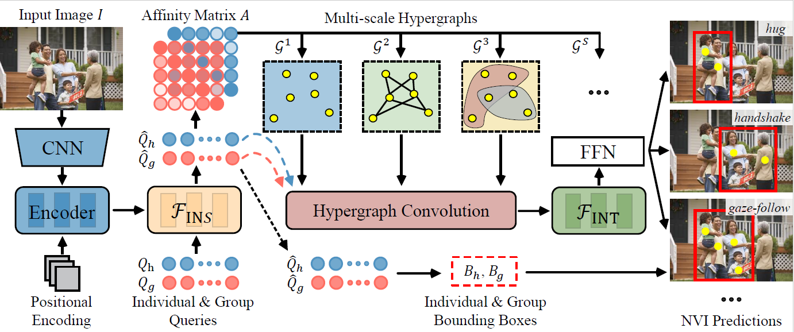

# NVI-DEHR
Code for our ECCV 2024 paper "[Understanding nonverbal interaction in social environment]()".

Contributed by Jianan Wei*, Tianfei Zhou*, Yi Yang, and Wenguan Wang.



## Installation
Install the dependencies.
```
pip install -r requirements.txt
```

## Data preparation

### NVI
NVI dataset can be downloaded [here](https://drive.google.com/file/d/1zapIT43PquLbtuy0oe6pAISJ8ccosilt/view?usp=sharing). The downloaded annotation files have to be placed as follows.
```
data
 └─ NVI
     |─ annotations
     |   |─ train.json
     |   |─ test.json
     |   └─ val.json
     |─ images
     :
```

### HOI-DET
HICO-DET dataset can be downloaded [here](https://drive.google.com/open?id=1QZcJmGVlF9f4h-XLWe9Gkmnmj2z1gSnk) and the annotation files can be downloaded from [here](https://drive.google.com/open?id=1WI-gsNLS-t0Kh8TVki1wXqc3y2Ow1f2R).

V-COCO dataset can be downloaded [here](https://github.com/s-gupta/v-coco) and the prior file `prior.pickle` from [here](https://drive.google.com/drive/folders/10uuzvMUCVVv95-xAZg5KS94QXm7QXZW4).

For more details, check out the [GEN-VLKT](https://github.com/YueLiao/gen-vlkt).

## Pre-trained model
Download the pre-trained model of DETR detector for [ResNet50](https://dl.fbaipublicfiles.com/detr/detr-r50-e632da11.pth), and put it in the `params` directory.
```
python ./tools/convert_parameters.py \
        --load_path params/detr-r50-e632da11.pth \
        --save_path params/detr-r50-pre-2branch-nvi.pth \
        --num_queries 64

python ./tools/convert_parameters.py \
        --load_path params/detr-r50-e632da11.pth \
        --save_path params/detr-r50-pre-2branch-hico.pth \
        --num_queries 64

python ./tools/convert_parameters.py \
        --load_path params/detr-r50-e632da11.pth \
        --save_path params/detr-r50-pre-2branch-vcoco.pth \
        --dataset vcoco \
        --num_queries 64
```

## Training
After the preparation, you can start training with the following commands.
### NVI
```
sh ./config/nvi.sh
```
### HICO-DET
```
sh ./config/hico.sh
```
### V-COCO
```
sh ./configs/vcoco.sh
```


## Evaluation

### NVI
You can evaluate with trained parameters for NVI as follows.
```
python -m torch.distributed.launch \
        --nproc_per_node=4 \
        --use_env \
        main.py \
        --pretrained pretrained/detr-r50-pre-2branch-nvi.pth \
        --dataset_file vpic \
        --backbone resnet50 \
        --num_queries 64 \
        --dec_layers 3 \
        --num_workers 2 \
        --epochs 90 \
        --lr_drop 60 \
        --batch_size 4 \
        --use_nms_filter \
        --set_cost_bbox 2.5 \
        --set_cost_giou 1 \
        --bbox_loss_coef 2.5 \
        --giou_loss_coef 1 \
        --mimic_loss_coef 2 \
        --n_layer 5 \
```

### HICO-DET
You can conduct the evaluation with trained parameters for HICO-DET as follows.
```
python -m torch.distributed.launch \
        --nproc_per_node=8 \
        --use_env \
        main.py \
        --pretrained pretrained/hico_gen_vlkt_s.pth \
        --dataset_file hico \
        --hoi_path data/hico_20160224_det \
        --num_obj_classes 80 \
        --num_verb_classes 117 \
        --backbone resnet50 \
        --num_queries 64 \
        --dec_layers 3 \
        --eval \
        --with_clip_label \
        --with_obj_clip_label \
        --use_nms_filter
```

For the official evaluation (reported in paper), you need to covert the prediction file to a official prediction format following [this file](./tools/covert_annot_for_official_eval.py), and then follow [PPDM](https://github.com/YueLiao/PPDM) evaluation steps.
### V-COCO
Firstly, you need the add the following main function to the vsrl_eval.py in data/v-coco.
```
if __name__ == '__main__':
  import sys

  vsrl_annot_file = 'data/vcoco/vcoco_test.json'
  coco_file = 'data/instances_vcoco_all_2014.json'
  split_file = 'data/splits/vcoco_test.ids'

  vcocoeval = VCOCOeval(vsrl_annot_file, coco_file, split_file)

  det_file = sys.argv[1]
  vcocoeval._do_eval(det_file, ovr_thresh=0.5)
```

Next, for the official evaluation of V-COCO, a pickle file of detection results has to be generated. You can generate the file with the following command. and then evaluate it as follows.
```
python generate_vcoco_official.py \
        --param_path pretrained/VCOCO_GEN_VLKT_S.pth \
        --save_path vcoco.pickle \
        --hoi_path data/v-coco \
        --num_queries 64 \
        --dec_layers 3 \
        --use_nms_filter \
        --with_clip_label \
        --with_obj_clip_label

cd data/v-coco
python vsrl_eval.py vcoco.pickle

```

## Citation
Please consider citing our paper if it helps your research.
```

```

## License
NVI-DEHR is released under the MIT license. See [LICENSE](./LICENSE) for additional details.

## Acknowledge
Some of the codes are built upon [PPDM](https://github.com/YueLiao/PPDM), [DETR](https://github.com/facebookresearch/detr), [QPIC](https://github.com/hitachi-rd-cv/qpic) and [CDN](https://github.com/YueLiao/CDN), [GEN-VLKT](https://github.com/YueLiao/gen-vlkt). Thanks for their great work!


